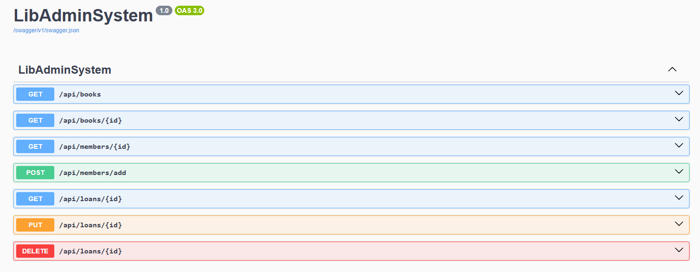

# LibAdminSystem

<div align="center">
  

  <p><em>A library management enterprise system built using ASP.NET Core + Entity Framework Core + LINQ + MySQL. Provides REST endpoints 
for managing books, members and loans.</em></p>

  <p>
    <a href="https://github.com/DivyenduDutta/LibAdminSystem/actions"></a>
    <a href="https://github.com/DivyenduDutta/LibAdminSystem/blob/master/LICENSE"></a>
    <a href="#"></a>
  </p>

  <p>
    <a href="#introduction">Introduction</a> •
    <a href="#features">Features</a> •
    <a href="#tech-stack">Tech Stack</a> •
    <a href="#getting-started">Getting Started</a> •
    <a href="#api-endpoints">API Endpoints</a> •
    <a href="#documentation">Documentation</a>
  </p>
</div>

## Introduction

LibAdminSystem is a lightweight library management system built with ASP.NET Core Minimal APIs, Entity Framework Core, and
MySQL. It provides RESTful endpoints for managing core library operations such as tracking books, members, and loans.

The goal of this project is to serve as both:

- A practical example of using modern .NET technologies (Minimal APIs, EF Core, LINQ) in a clean, modular design.

- A foundation for building out more complex administrative systems where database backed CRUD operations are exposed through REST services.

## Features

- CRUD operations for:
	
	- Books

	- Members

	- Loans

- REST API endpoints with ASP.NET Core Minimal APIs

- Entity Framework Core with MySQL provider

- LINQ queries for flexible data access

- Seed data on first run

## Tech Stack

**Language**: C# (.NET Core 9.0.x) + LINQ

**Frameworks**: ASP.NET Core, EF Core

**Database**: MySQL

**ORM**: Entity Framework Core

**CI/CD**: GitHub Actions

## Getting Started

### Prerequisites

Install the following NuGet packages (if it doesnt get installed automatically):
	
- `Microsoft.EntityFrameworkCore`

- `Pomelo.EntityFrameworkCore.MySql` - `Pomelo` is the go-to EF Core provider for MySQL.

- `Microsoft.EntityFrameworkCore.Tools`	

- `Microsoft.EntityFrameworkCore.Design`

- `Swashbuckle.AspNetCore` - For Swagger REST API documentation support

### Setup

1. Clone the repo

```bash
git clone https://github.com/DivyenduDutta/LibAdminSystem.git
cd LibAdminSystem

```

2. Ensure that your MySQL server is running and the proper connection string is mentioned in `appsettings.json` as below:

```json
{
   "ConnectionStrings": {
		"LibAdminSystem": "<your MySQL connection string>"
  }
}
```

See [this](https://stackoverflow.com/questions/29866204/how-to-change-the-default-port-of-mysql-from-3306-to-3360) regarding how to change MySQL server port.

3. Run `dotnet tool install --global dotnet-ef` to install dotnet-ef if you haven't already.

4. Generate the EF migrations and create the MySQL database with the required tables (`Note` - Make sure to delete the
existing Migrations folder as part of this repo before doing the below).

```dotnet
dotnet ef migrations add InitialCreate
dotnet ef database update
```

5. Run `Program.cs` to seed the database with sample data on first run and to start the REST server. The REST services can be 
tested with the `LibAdminSystem.http` file using [Endpoints Explorer](https://learn.microsoft.com/en-us/aspnet/core/test/http-files?view=aspnetcore-9.0#use-endpoints-explorer). 

### Sanity

Run `dotnet format LibAdminSystem.sln --verify-no-changes` to check first for formatting/linting errors. 

Then either fix manually or run `dotnet format LibAdminSystem.sln`

## API Endpoints

Refer to [LibAdminSystem.http](https://github.com/DivyenduDutta/LibAdminSystem/blob/master/LibAdminSystem.http) for example JSON payloads for `POST/PUT`

### Books

| Method | Endpoint          | Description      |
| ------ | ----------------- | ---------------- |
| GET    | `/api/books`      | Get all books    |
| GET    | `/api/books/{id}` | Get a book by ID |

### Members

| Method | Endpoint            | Description           |
| ------ | ------------------- | --------------------- |
| GET    | `/api/members/{id}` | Get a member by ID    |
| POST   | `/api/members/add`  | Register a new member |

### Loans

| Method | Endpoint                 | Description               |
| ------ | ------------------------ | ------------------------- |
| GET    | `/api/loans/{id}`        | Get a loan by ID          |
| PUT    | `/api/loans/{id}/return` | Update details of a borrowed book    |
| DELETE | `/api/loans/{id}`        | Cancel a loan |

## Documentation

LibAdminSystem uses Swagger UI via Swashbuckle. This provides a full interactive web UI where we can test endpoints right from 
the browser.

Run `Program.cs` and this will open up the API document UI at `http://localhost:<port>/index.html`

The following functionality is provided via Swagger:

- API endpoints grouped by route

- Request/response schemas auto-generated from the model classes

- “Try it out” button to execute requests against the running service



